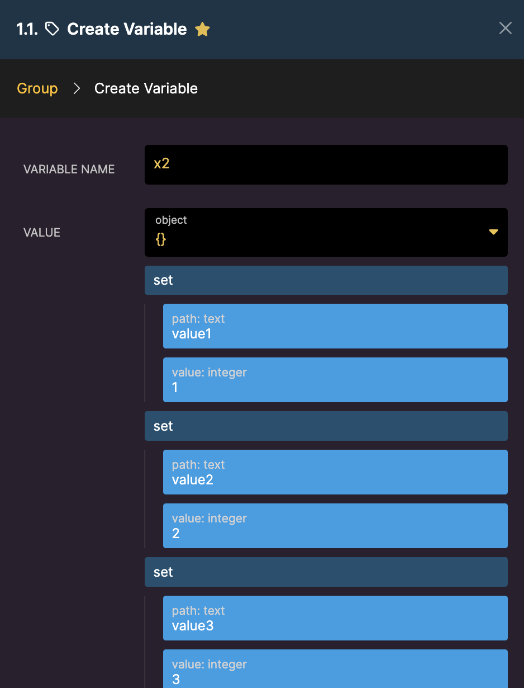
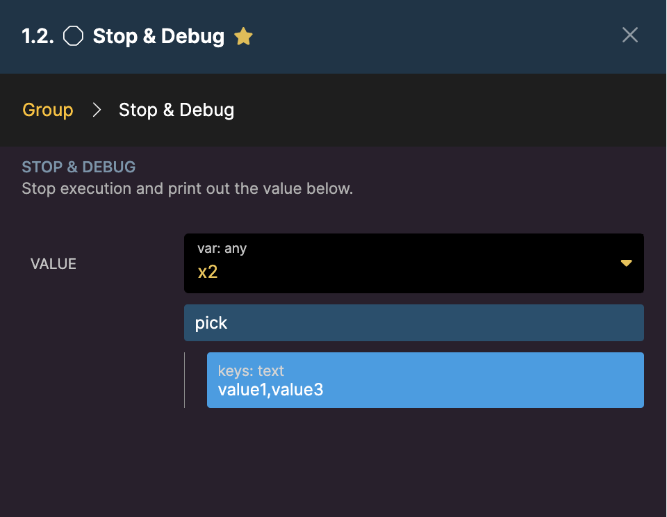
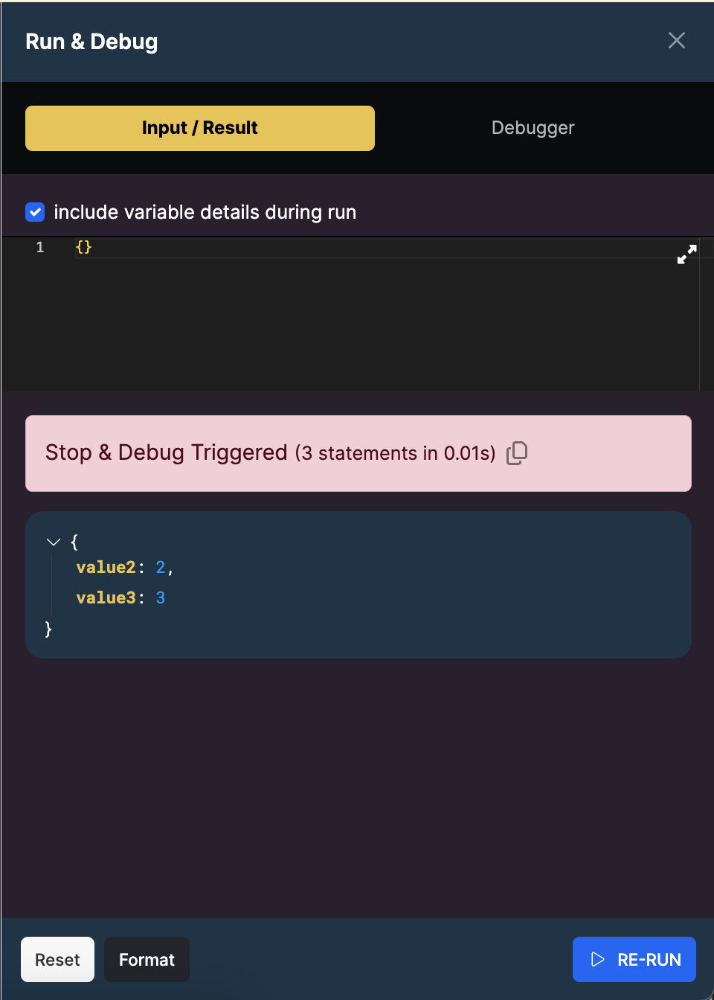
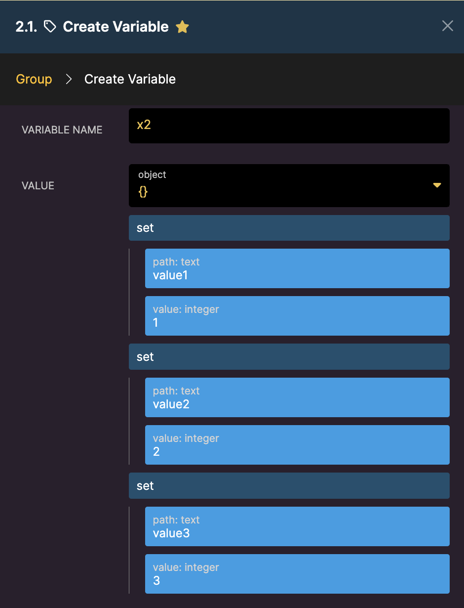
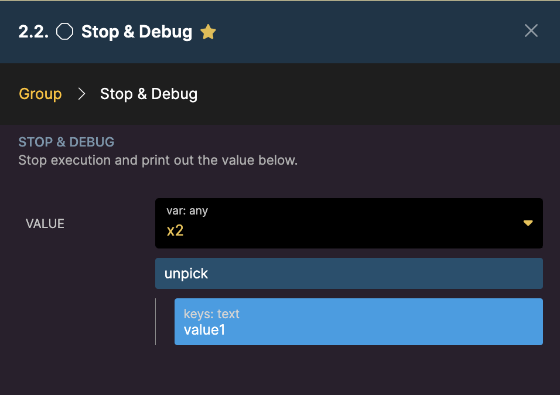

# Array

* [**append**](array.md#append) **-** Push an element on to the end of an array within an object and return the updated object
* [**count**](array.md#count) **-** Return the number of items of an array
* [**diff**](array.md#diff-diff_assoc) **-** Return values from the first array not present in the second. Only values are used for matching.
* [**diff\_assoc**](array.md#diff-diff_assoc) **-** Return values from the first array not present in the second. Keys and values are used for matching.
* [**filter\_empty**](array.md#filter_empty) **-** Returns a new array with only entries that are not empty ("", null, 0, \[])
* [**first**](array.md#first) **-** Returns the first item of an array
* [**flatten**](array.md#flatten) **-** Flattens a multi-dimensional array
* [**intersect**](array.md#intersect-intersect_assoc) **-** Return values from the first array that are present in the second. Only values are used for matching.
* [**interesct\_assoc**](array.md#intersect-intersect_assoc) **-** Return values from the first array that are present in the second. Keys and values are used for matching.
* [**join**](array.md#join) **-** Joins an array into a text string via the separator and returns the result
* [**last**](array.md#last) **-** Returns the last item of an array
* [**merge**](array.md#merge) **-** Merges two arrays
* [**merge\_recursive**](array.md#merge_recursive) **-** Merge all levels of both arrays
* [**pop**](array.md#pop) **-** Pops the last element of an array off and returns it
* [**prepend**](array.md#prepend) **-** Prepend an element on to the beginning of an array
* [**push**](array.md#push) **-** Push an element on to the end of an array
* [**range**](array.md#range) **-** Returns array of values between the specified start/stop
* [**remove**](array.md#remove) **-** Remove any elements from the array that match the supplied value and return the new array
* [**safe\_array**](array.md#safe_array) **-** Always return an array from the specified value
* [**shift**](array.md#shift) **-** Shifts the first element off the Array and returns it
* [**shuffle**](array.md#shuffle) **-** Returns the array in a randomized order
* [**slice**](array.md#slice) **-** Extracts a specific section of an array
* [**sort**](array.md#sort) **-** Sorts an array
* [**unique**](array.md#unique) **-** Returns the array with duplicate values removed
* [**unshift**](array.md#unshift) **-** Push an element to the beginning of an Array and return the new array
* [**pick**](array.md#pick-unpick) **-** Pick keys from the object to create a new object of just those keys.
* [**unpick**](array.md#pick-unpick) **-** Remove keys from the object to create a new object of the remaining keys.

### append

Push an element on to the end of an Array within an object and return the updated object.

![In this example, we have an Array of \[ 1,2,2,1 \] by using the append filter the variable becomes \[ 1,2,2,1,100\]. ](../../.gitbook/assets/arrayappend.png)


***

### count

Return the number of items of an Array.

![In this example, we have an Array of \[ 1,2,2,1 \] by using the count filter the variable becomes 4.](../../.gitbook/assets/count.png)

***

### diff / diff\_assoc

These filters will return values in the first array that are not present in the second array.

* **diff** will only use values for matching
*   **diff\_assoc** will use keys and values for matching\


    <figure><figcaption></figcaption></figure>

***

### filter\_empty

Returns a new Array with only entries that are not empty ("", null, 0, \[]).

![In this example, we have an Array of \[ 1,2,,2,1 \] by using the filter\_empty the variable becomes \[ 1,2,2,1 \].](../../.gitbook/assets/Screenshot_2020-06-25_21-23-33.png)

***

### first

Get the first entry of an Array.

![In this example, we have an Array of \[ 1,2,0,2,1 \] by using the first filter the variable becomes 1.](../../.gitbook/assets/first.png)


***

### flatten

Flattens a multi-level array into a single-level array.

<figure><figcaption></figcaption></figure>

***

### intersect / intersect\_assoc

Returns the entries from the first array that are present in the second array.

* **intersect** will use values for matching
* **intersect\_assoc** will use keys and values for matching

<figure><figcaption></figcaption></figure>

***

### join

Joins an array into a text string via the separator and returns the result\
In the below example, we have an array of \[ 1,2,3,4 ] and we use the join filter with the text **:hello:**\
\
The variable becomes 1:hello:2:hello:3:hello:4\


***

### last

Get the last entry of an Array.

![In this example, we have an Array of \[ 1,2,0,2 \] by using the last filter the variable becomes 2.](../../.gitbook/assets/last.png)

***

### merge

Merge the first level of elements of both Arrays together and return the new array.

![Example: we have an Array of \[ 1,2,0,2,1 \] by using the merge filter the variable becomes \[1, 2, 0, 2, 1, "123"\].](../../.gitbook/assets/merge.png)

***

### merge\_recursive

Merge the elements from all levels of both Arrays together and return the new Array.

We will set up our first array as var\_1 using this JSON:

```
{
"a": "test",
"b": ["a","b"]
}
```

We will set up our second array as var\_2 using this JSON:

```
{
"c": "hi",
"b": ["c","d"]
}
```

We will then set up our filter as follows:


var\_3 would then become:

```
{
"a": "test",
"b": ["a",b","c","d"]
}{
"c": "hi",
}
```

***

### pop

Pops the last element of the Array off and returns it.

![In this example, we have an Array of \[ 1,2,0,2,1 \] by using the pop filter the variable becomes 1.](../../.gitbook/assets/pop.png)

***

### prepend

Push an element on to the beginning of an Array within an object and return the updated object.

![In this example, we have an Array of \[ 1,2,0,2,1 \] using the prepend filter the variable becomes \[ 23,1,2,0,2,1\].](../../.gitbook/assets/prepend.png)

***

### push

Push an element on to the end of an Array within an object and return the updated object.

![In this example, we are using the push filter to create the Array \[1, 2, 0, 2, 1\].](../../.gitbook/assets/push.png)

***

### range

Returns array of values between the specified start/stop.\
In this example we have an array \[1,2,3,4,5 ] and we are using the filter range with the values of start: 2 and stop 4, this returns the array of \[2,3,4]


***

### remove

Remove any elements from the array that match the supplied value and return the new array\
In this example we have an array \[1,2,3,4,5,6]

![After we apply the remove filter with the value of 3 the array becomes: \[1,2,4,5,6\] ](https://mrkr.io/s/603d3cb9040e8a61796d7df7/0)

Let's change the array to a more complex one:\
`[ { "name":"Ford"}, { "name":"GM" }, { "name":"Chevrolet"  } ]`

In this example we will need to specify the path.

![After we apply the remove filter the array becomes: \[ { "name":"GM" }, { "name":"Chevrolet"  } \]](https://mrkr.io/s/603d3ef6d956b957b3009294/0)

***

### safe\_array

Always returns an array. Uses the existing value if it is an array or creates an array of one element.

<figure><figcaption></figcaption></figure>

***

### shift

Shifts the first element off the Array and returns it.

![In this example, we have an Array of \[ 1,2,0,2,1 \] by using the shift filter the variable becomes 1.](../../.gitbook/assets/shift.png)

***

### shuffle

Returns the array in a randomized order

<figure><figcaption></figcaption></figure>

***

### slice

Extracts and returns a section of an array

* **offset** - what index should the slice start, starting at 0
* **length** - how many items to slice

<figure><figcaption></figcaption></figure>

***

### sort

Sort an Array of elements with an optional path inside the element, sort type, and ascending/descending. \
Sort types include:

* **text** - case-sensitive sort for text
* **itext** - case-insensitive sort for text
* **number** - to sort numerically
* **natural** - case-sensitive sort that is alphanumerical and natural to humans
* **inatural** - case-insensitive sort that is alphanumerical and natural to humans

Ascending order is performed with a true boolean. Descending order uses a false boolean.&#x20;

The example below shows the difference between case-sensitivity sort with text and itext:


The example below shows how to use the number sort type:


\
The example below shows the difference in sorting between natural and number when dealing with alphanumeric values:


***

### unique

Returns unique values of an Array. You can also use this filter with an array of objects by specifying a path to the key you would like to use to judge uniqueness.

![In this example, we have an Array of \[ 1,2,0,2,1 \] using the unique filter the variable becomes \[ 1,2,0\].](../../.gitbook/assets/unique.png)

***

### unshift

Push an element to the beginning of an Array and return the new Array.

![In this example, we have an Array of \[ 1,2,0,2,1 \] using the unshift filter the variable becomes \[ 58,1,2,0,2,1\].](../../.gitbook/assets/unshift.png)

***

### pick/unpick

These filters are meant to be used when dealing with Object field types and are particularly useful if you are receiving a large object, from a webhook for example, where only a few of those records are required for your workflows. You can also use them with an array of objects by specifying a path to the key you would like to make changes to.


**Pick**: Identify values you would like to keep and the filter will return a new object containing only the values you have selected.

<figure><figcaption><p>Example Object </p></figcaption></figure>

<figure><figcaption><p>Defining the Keys we want to include in our new object.</p></figcaption></figure>

<figure><figcaption><p>Result</p></figcaption></figure>


**Unpick**: Identify values you would like to exclude and the filter will return a new object containing only the fields that weren’t omitted.

<figure><figcaption><p>Example Object</p></figcaption></figure>

<figure><figcaption><p>Defining the Keys we want to exclude from our new object.</p></figcaption></figure>

<figure><figcaption><p>Result</p></figcaption></figure>
