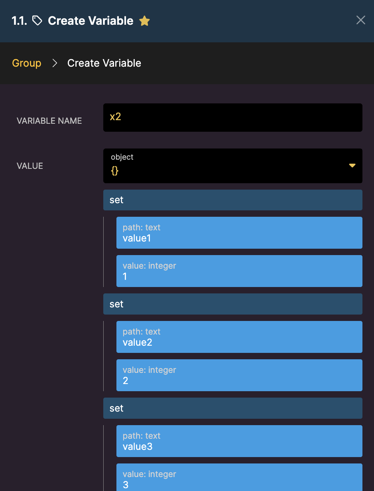
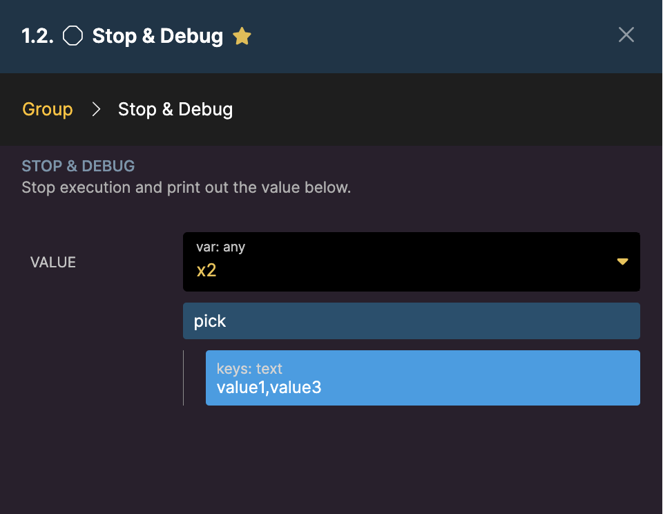
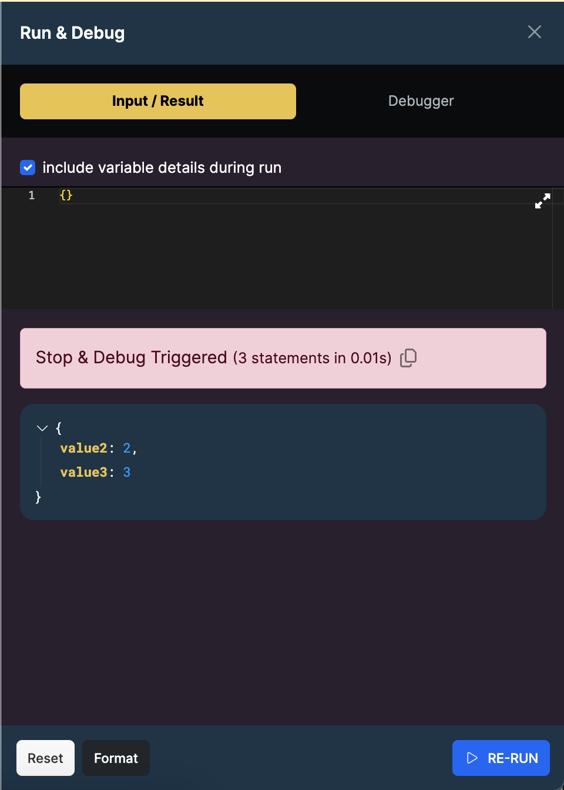
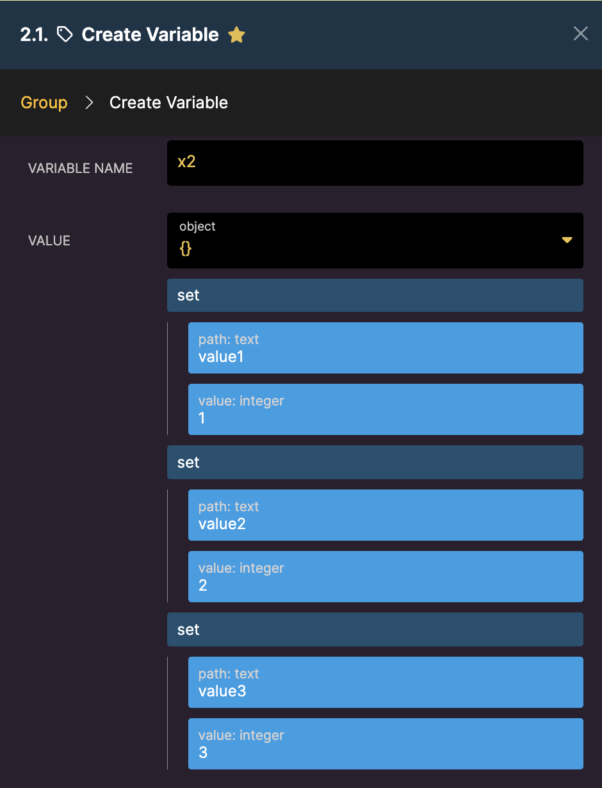
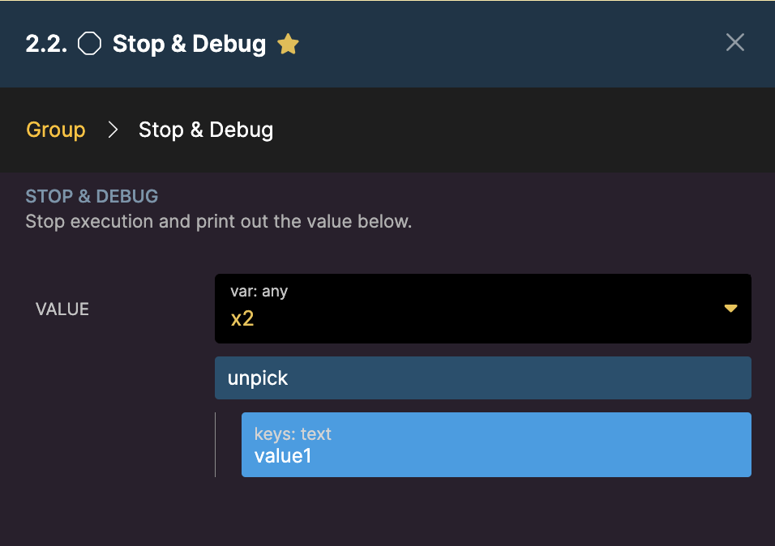

# Array



```
[
    {
        "name": "Chris"
        },
    {
        "name": "Shawn"
        }
]
```

### append

Adds a new element to the end of the array, and return the updated array

<figure><figcaption></figcaption></figure>

| Parameter    | Purpose                                  | Example    |
| ------------ | ---------------------------------------- | ---------- |
| parent value | The original array you'd like to modify  | \[1,2,3,4] |
| value        | The value to add to the end of the array | 5          |

<table><thead><tr><th>Example</th><th>Result</th></tr></thead><tbody><tr><td>parent value: <code>[1, 2, 3, 4]</code><br>value: 5</td><td><code>[1, 2, 3, 4, 5]</code></td></tr><tr><td>parent value: <code>["Think Visually", "Build Confidently"]</code><br>value: "Deploy Securely"</td><td><code>["Think Visually, Build Confidently, "Deploy Securely"]</code></td></tr><tr><td><p>parent value:</p><pre class="language-json"><code class="lang-json">[
<strong>    {
</strong>        "name": "Chris"
        },
    {
        "name": "Shawn"
        }
]
</code></pre><p>value:</p><pre><code>{
        "name": "Cameron"
        }
</code></pre></td><td><pre><code>[
<strong>    {
</strong>        "name": "Chris"
        },
    {
        "name": "Shawn"
        },
    {
        "name": "Cameron"
        }
]
</code></pre></td></tr></tbody></table>

***

### count

Returns the number of items in an array

<figure><figcaption></figcaption></figure>

<table><thead><tr><th width="140.059326171875">Paremeter</th><th width="180.9156494140625">Purpose</th><th>Example</th></tr></thead><tbody><tr><td>parent value</td><td>The array to count</td><td><code>[1, 2, 3, 4, 5]</code></td></tr><tr><td></td><td></td><td><pre class="language-json"><code class="lang-json">[
<strong>    {"name": "Chris"},
</strong>    {"name": "Shawn"}
]
</code></pre></td></tr></tbody></table>

<table><thead><tr><th>Example</th><th>Output</th></tr></thead><tbody><tr><td><pre class="language-json"><code class="lang-json">[
<strong>    {"name": "Chris"},
</strong>    {"name": "Shawn"}
]
</code></pre></td><td>2</td></tr><tr><td><code>[1, 2, 3, 4, 5]</code></td><td>5</td></tr></tbody></table>

***

### diff / diff\_assoc

### intsersect / intersect\_assoc

These filters are used to compare arrays.

* **diff** is used to show values from the first array that **are not** in the second array
* **intersect** is used to show values from the first array that **are** in the second array

Use the basic filter for value arrays, and the **\_assoc** version for arrays of objects.

<figure><figcaption></figcaption></figure>

<table><thead><tr><th width="146.95941162109375">Parameter</th><th>Purpose</th><th>Example</th></tr></thead><tbody><tr><td>parent value</td><td>The first array to compare</td><td><code>[1, 2, 3, 4, 5]</code></td></tr><tr><td></td><td></td><td><pre class="language-json"><code class="lang-json">[
<strong>    {"name": "Chris"},
</strong>    {"name": "Shawn"}
]
</code></pre></td></tr><tr><td>value</td><td>The second array to compare</td><td>Same as above</td></tr></tbody></table>

<table><thead><tr><th>Example</th><th>Output</th></tr></thead><tbody><tr><td>Using <strong>diff:</strong><br>parent value: <code>[1,2,3,4,5]</code><br>value: <code>[3,4,5,6,7]</code></td><td><code>[1, 2]</code></td></tr><tr><td><p>Using <strong>diff_assoc:</strong><br>parent value:</p><pre class="language-json"><code class="lang-json"><strong>[
</strong>    {"name": "Chris"},
    {"name": "Shawn"},
    {"name": "Cameron"}
]
</code></pre><p>value:</p><pre class="language-json"><code class="lang-json">[
    {"name": "Chris"},
    {"name": "Shawn"}
]
</code></pre></td><td><pre class="language-json"><code class="lang-json">[
    {"name":"Cameron"}
]
</code></pre></td></tr><tr><td>Using <strong>intersect:</strong><br>parent value: <code>[1,2,3,4,5]</code><br>value: <code>[3,4,5,6,7]</code></td><td><code>[3, 4, 5]</code></td></tr><tr><td><p></p><p>Using <strong>intersect_assoc:</strong><br>parent value:</p><pre class="language-json"><code class="lang-json"><strong>[
</strong>    {"name": "Chris"},
    {"name": "Shawn"}
]
</code></pre><p>value:</p><pre class="language-json"><code class="lang-json">[
    {"name": "Chris"},
    {"name": "Shawn"},
    {"name": "Cameron"}
]
</code></pre></td><td><pre class="language-json"><code class="lang-json">[
    {"name": "Chris"},
    {"name": "Shawn"}
]
</code></pre></td></tr></tbody></table>

***

### filter\_empty

Returns a new srray with only entries that are not empty.

An **empty** value can be `[]`, `{}`, `0`, `null`, `""`, or `false`.

<figure><figcaption></figcaption></figure>

<table><thead><tr><th>Parameter</th><th>Purpose</th><th>Example</th></tr></thead><tbody><tr><td>parent value</td><td>The array to filter</td><td><code>[1, 0, 2, 0, 3]</code></td></tr><tr><td></td><td></td><td><pre class="language-json"><code class="lang-json">[
    {"name":"Chris"},
    {},
    {"name":"Shawn"}
]
</code></pre></td></tr><tr><td>path</td><td>When filtering arrays of objects, you can specify a path to optionally use a specific key to judge emptiness.</td><td></td></tr></tbody></table>

<table><thead><tr><th>Example</th><th>Output</th></tr></thead><tbody><tr><td><pre class="language-json"><code class="lang-json">[
    {"name":"Chris"},
    {},
    {"name":"Shawn"}
]
</code></pre></td><td><pre class="language-json"><code class="lang-json">[
    {"name":"Chris"},
    {"name":"Shawn"}
]
</code></pre></td></tr><tr><td><code>[1, 0, 2, 0, 3]</code></td><td><code>[1, 2, 3]</code></td></tr></tbody></table>

***

### first

Get the first entry of an Array.

<figure><figcaption></figcaption></figure>

<table><thead><tr><th width="129.734375">Parameter</th><th>Purpose</th><th>Example</th></tr></thead><tbody><tr><td>parent value</td><td>The array to retrieve the first entry from</td><td><code>[1, 2, 3]</code></td></tr><tr><td></td><td></td><td><pre><code>[
    {"name":"Chris"},
    {"name":"Shawn"}
]
</code></pre></td></tr></tbody></table>

<table><thead><tr><th>Example</th><th>Output</th></tr></thead><tbody><tr><td><code>[1, 2, 3]</code></td><td>1</td></tr><tr><td><pre class="language-json"><code class="lang-json">[
    {"name":"Chris"},
    {"name":"Shawn"}
]
</code></pre></td><td><pre class="language-json"><code class="lang-json">{"name":"Chris"}
</code></pre></td></tr></tbody></table>

***

## filter

* **$this** - the context variable that represents the element of the array being processed.
* **$index** - the context variable that represents the numerical index of the element of the array being processed.
* **$parent** - the context variable that represents the entire array with all of its elements.

This filter (also called **find all elements**) is identical to the **find** filter except that it returns all elements that match the condition. Even if there is only one match, it would return an array of one. A common use case would be finding all products that have a price greater than 10.


```javascript
return $this.price > 10;
```

| Example Use Case                                      | Input Array                                                                                       | Filter Expression                           | Result                                                             |
| ----------------------------------------------------- | ------------------------------------------------------------------------------------------------- | ------------------------------------------- | ------------------------------------------------------------------ |
| Find all products with price > 10 (using `$this`)     | `[{"name": "apple", "price": 5}, {"name": "banana", "price": 12}, {"name": "pear", "price": 20}]` | `filter(products, $this.price > 10)`        | `[{"name": "banana", "price": 12}, {"name": "pear", "price": 20}]` |
| Get all even-indexed items (using `$index`)           | `["a", "b", "c", "d"]`                                                                            | `filter(array, $index % 2 == 0)`            | `["a", "c"]`                                                       |
| Find items greater than the average (using `$parent`) | `[1, 5, 10, 15]`                                                                                  | `filter(numbers, $this > average($parent))` | `[10, 15]`                                                         |
| Match specific string (case-sensitive)                | `["cat", "dog", "cow"]`                                                                           | `filter(animals, $this == "dog")`           | `["dog"]`                                                          |
| Return all names starting with "J"                    | `["John", "Jane", "Alice"]`                                                                       | `filter(names, startsWith($this, "J"))`     | `["John", "Jane"]`                                                 |

***

### filter\_empty\_array

### filter\_empty\_object

### filter\_empty\_text

### filter\_false

### filter\_null

### filter\_zero

These filters are designed to remove the corresponding values from an object or an array. Useful in scenarios where something is sending data to your APIs that you don't have full control over, such as a frontend platform that always sends empty strings or null values.

| Parameter    | Purpose                       |
| ------------ | ----------------------------- |
| parent value | The array or object to target |

<table><thead><tr><th>Example</th><th>Output</th></tr></thead><tbody><tr><td><p></p><pre class="language-json"><code class="lang-json"><strong>{
</strong>        "title": "",
        "name": false,
        "width": 0,
        "items": [],
        "data": {},
        "info": null
}
</code></pre></td><td><p><strong>filter_empty_array</strong></p><pre class="language-json"><code class="lang-json">{
        "title": "",
        "name": false,
        "width": 0,
        "data": {},
        "info": null
}
</code></pre></td></tr><tr><td><pre class="language-json"><code class="lang-json"><strong>{
</strong>        "title": "",
        "name": false,
        "width": 0,
        "items": [],
        "data": {},
        "info": null
}
</code></pre></td><td><p><strong>filter_empty_object</strong></p><pre class="language-json"><code class="lang-json">{
        "title": "",
        "name": false,
        "width": 0,
        "items": [],
        "info": null
}
</code></pre></td></tr><tr><td><pre class="language-json"><code class="lang-json"><strong>{
</strong>        "title": "",
        "name": false,
        "width": 0,
        "items": [],
        "data": {},
        "info": null
}
</code></pre></td><td><p><strong>filter_empty_text</strong></p><pre class="language-json"><code class="lang-json">{
        "name": false,
        "width": 0,
        "items": [],
        "data": {},
        "info": null
}
</code></pre></td></tr><tr><td><pre class="language-json"><code class="lang-json"><strong>{
</strong>        "title": "",
        "name": false,
        "width": 0,
        "items": [],
        "data": {},
        "info": null
}
</code></pre></td><td><p><strong>filter_false</strong></p><pre class="language-json"><code class="lang-json">{
        "title": "",
        "width": 0,
        "items": [],
        "data": {},
        "info": null
}
</code></pre></td></tr><tr><td><pre class="language-json"><code class="lang-json"><strong>{
</strong>        "title": "",
        "name": false,
        "width": 0,
        "items": [],
        "data": {},
        "info": null
}
</code></pre></td><td><p><strong>filter_null</strong></p><pre class="language-json"><code class="lang-json">{
        "title": "",
        "name": false,
        "width": 0,
        "items": [],
        "data": {}
}
</code></pre></td></tr><tr><td><pre class="language-json"><code class="lang-json"><strong>{
</strong>        "title": "",
        "name": false,
        "width": 0,
        "items": [],
        "data": {},
        "info": null
}
</code></pre></td><td><p><strong>filter_zero</strong></p><pre class="language-json"><code class="lang-json">{
        "title": "",
        "name": false,
        "items": [],
        "data": {},
        "info": null
}
</code></pre></td></tr></tbody></table>

***

### flatten

Flattens a multi-level array into a single-level array.

<table><thead><tr><th width="118.7906494140625">Parameter</th><th width="174.70306396484375">Purpose</th><th>Example</th></tr></thead><tbody><tr><td>parent value</td><td>The array to flatten</td><td><pre class="language-json"><code class="lang-json">[
  [1, 2, 3],
  [4, 5, 6],
  [7, 8, 9]
]
</code></pre></td></tr></tbody></table>

<table><thead><tr><th>Example</th><th>Output</th></tr></thead><tbody><tr><td><pre class="language-json"><code class="lang-json">[
  [1, 2, 3],
  [4, 5, 6],
  [7, 8, 9]
]
</code></pre></td><td><pre class="language-json"><code class="lang-json">[1, 2, 3, 4, 5, 6, 7, 8, 9]
</code></pre></td></tr><tr><td><pre class="language-json"><code class="lang-json">[
  {
    id: 1,
    name: "John",
    pets: [
      { type: "dog", name: "Rex" },
      { type: "cat", name: "Whiskers" }
    ]
  },
  {
    id: 2,
    name: "Sarah",
    pets: [
      { type: "bird", name: "Tweety" }
    ]
  }
]]
</code></pre></td><td><pre class="language-json"><code class="lang-json">[
  {
    ownerId: 1,
    ownerName: "John",
    petType: "dog",
    petName: "Rex"
  },
  {
    ownerId: 1,
    ownerName: "John",
    petType: "cat",
    petName: "Whiskers"
  },
  {
    ownerId: 2,
    ownerName: "Sarah",
    petType: "bird",
    petName: "Tweety"
  }
]
</code></pre></td></tr></tbody></table>

***

### join

Converts an array into a text string by _joining_ each value and using a separator.

<figure><figcaption></figcaption></figure>

| Parameter                     | Purpose                                                         | Example                                             |
| ----------------------------- | --------------------------------------------------------------- | --------------------------------------------------- |
| parent value                  | The array to join                                               | \["a", "b", "c"]                                    |
| separator <sup>optional</sup> | The character or characters to place in between each array item | Can be any text value, or even a single empty space |

| Example                                                           | Output  |
| ----------------------------------------------------------------- | ------- |
| <p>parent value: <code>["a", "b", "c"]</code><br>separator: _</p> | `a_b_c` |
| <p>parent value: [1, 2, 3, 4, 5]<br>separator:</p>                | `12345` |

***

### last

Get the last entry of an Array.

<figure><figcaption></figcaption></figure>

| Parameter    | Purpose                            | Example      |
| ------------ | ---------------------------------- | ------------ |
| parent value | The array to get the last entry of | \[`1, 2, 3]` |

| Example     | Output |
| ----------- | ------ |
| `[1, 2, 3]` | `3`    |

***

### merge

### merge\_recursive

Merge two arrays or objects together and return the new item.

* Use **merge** to merge single level data.
* Use **merge\_recursive** to merge multi-level data.

<figure><figcaption></figcaption></figure>

| Parameter    | Purpose                   | Example    |
| ------------ | ------------------------- | ---------- |
| parent value | The first array to merge  | \[1, 2, 3] |
| value        | The second array to merge | \[4, 5, 6] |

<table><thead><tr><th>Example</th><th>Output</th></tr></thead><tbody><tr><td><p>using <strong>merge</strong></p><p>parent value: <code>["a", "b", "c"]</code><br>value: <code>["d", "e", "f"]</code></p></td><td><code>["a", "b", "c", "d", "e", "f"]</code></td></tr><tr><td><p>using <strong>merge_recursive</strong></p><p>parent value: </p><pre class="language-json"><code class="lang-json">{
    "a": "test",
    "b": ["a","b"]
}
</code></pre><p><br>value:</p><pre class="language-json"><code class="lang-json"><strong>{
</strong><strong>    "c": "hi",
</strong>    "b": ["c","d"]
}
</code></pre></td><td><pre class="language-json"><code class="lang-json">{
    "a": "test",
    "b": ["a","b","c","d"]
    "c": "hi",
}
</code></pre></td></tr></tbody></table>

***

### pop

Pops the last element of the Array off and returns it.


Please note that Xano's **pop** filter does NOT remove the item from the array.


<figure><figcaption></figcaption></figure>

***

### prepend

Push an element on to the beginning of an array

<figure><figcaption></figcaption></figure>

***

### push

Push an element on to the end of an array

<figure><figcaption></figcaption></figure>

***

### range

Returns array of values between the specified start/stop.

<figure><figcaption></figcaption></figure>

***

### remove

Remove any elements from the array that match the supplied value and return the new array

<figure><figcaption></figcaption></figure>

Use the **path** option to search inside of objects.

Use the **strict** option to determine how precise the filter is (for example, treating 100 and "100" the same)

***

### safe\_array

Always returns an array. Uses the existing value if it is an array or creates an array of one element.

<figure><figcaption></figcaption></figure>

***

### shift

Shifts the first element off the Array and returns it.

<figure><figcaption></figcaption></figure>

***

### shuffle

Returns the array in a randomized order

<figure><figcaption></figcaption></figure>

***

### slice

Extracts and returns a section of an array

* **offset** - what index should the slice start, starting at 0
* **length** - how many items to slice

<figure><figcaption></figcaption></figure>

***

### sort

Sort an Array of elements with an optional path inside the element, sort type, and ascending/descending. \
Sort types include:

* **text** - case-sensitive sort for text
* **itext** - case-insensitive sort for text
* **number** - to sort numerically
* **natural** - case-sensitive sort that is alphanumerical and natural to humans
* **inatural** - case-insensitive sort that is alphanumerical and natural to humans

Ascending order is performed with a true boolean. Descending order uses a false boolean.&#x20;

The example below shows the difference between case-sensitivity sort with text and itext:

<figure><figcaption></figcaption></figure>

<figure><figcaption></figcaption></figure>

The example below shows how to use the number sort type:

<figure><figcaption></figcaption></figure>

\
The example below shows using the natural sorting option

<figure><figcaption></figcaption></figure>

***

### unique

Returns unique values of an Array. You can also use this filter with an array of objects by specifying a path to the key you would like to use to judge uniqueness.

<figure><figcaption></figcaption></figure>

***

### unshift

Push an element to the beginning of an Array and return the new Array.

<figure><figcaption></figcaption></figure>

***

### pick/unpick

These filters are meant to be used when dealing with Object field types and are particularly useful if you are receiving a large object, from a webhook for example, where only a few of those records are required for your workflows. You can also use them with an array of objects by specifying a path to the key you would like to make changes to.


**Pick**: Identify values you would like to keep and the filter will return a new object containing only the values you have selected.

<figure><figcaption><p>Example Object </p></figcaption></figure>

<figure><figcaption><p>Defining the Keys we want to include in our new object.</p></figcaption></figure>

<figure><figcaption><p>Result</p></figcaption></figure>


**Unpick**: Identify values you would like to exclude and the filter will return a new object containing only the fields that weren’t omitted.

<figure><figcaption><p>Example Object</p></figcaption></figure>

<figure><figcaption><p>Defining the Keys we want to exclude from our new object.</p></figcaption></figure>

<figure><figcaption><p>Result</p></figcaption></figure>
