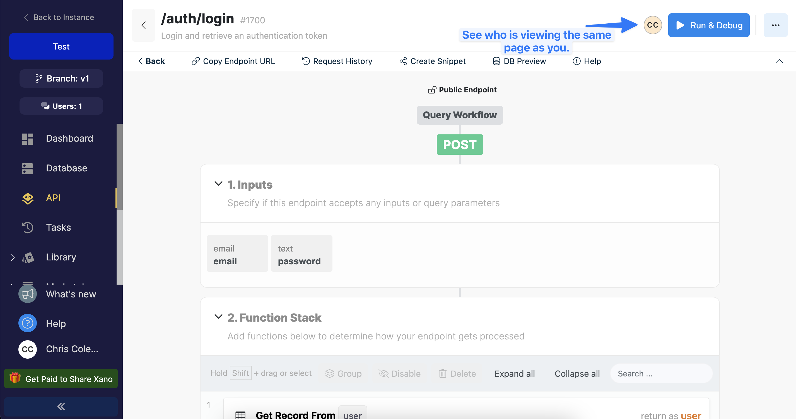

# Using AI Builders with Xano

<table data-card-size="large" data-view="cards"><thead><tr><th></th><th data-hidden data-card-target data-type="content-ref"></th><th data-hidden data-card-cover data-type="files"></th></tr></thead><tbody><tr><td> <strong>Using Xano with Cursor</strong></td><td><a href="https://youtu.be/m4YoJXaqdEc?si=-T0O0RXVTL93HHls">https://youtu.be/m4YoJXaqdEc?si=-T0O0RXVTL93HHls</a></td><td><a href="../.gitbook/assets/maxresdefault.jpg">maxresdefault.jpg</a></td></tr><tr><td> <strong>Using Swagger Docs with ChatGPT</strong></td><td></td><td><a href="../.gitbook/assets/4ULVUlsjN9U-HD.jpg">4ULVUlsjN9U-HD.jpg</a></td></tr></tbody></table>

## The Key: Auto-documented APIs

When you're building API endpoints in Xano, they're auto-documented in the OpenAPI specification using Swagger. This means that without any effort from you, you already have AI-ready documentation that can be used in combination with your favorite AI builder to spin up fully baked applications very quickly.

We have a full section on this functionality here: [swagger-openapi-documentation.md](../the-function-stack/building-with-visual-development/apis/swagger-openapi-documentation.md "mention"). For now though, you can get started quickly with the instructions below.



### Get your API documentation

Inside your API group(s), you'll find a link to the documentation in the top-right, as shown below.

<figure><figcaption></figcaption></figure>



### On the documentation page that opens, save the JSON version by right-clicking the link at the top and saving it.

You'll want to save separate files for each of the API groups that you want to use in the AI builder.

<figure><figcaption></figcaption></figure>




### Import the documentation into your AI of choice, and start building!

Here's a quick demo of us importing some API documentation into ChatGPT, and getting a fully functional app returned.


Please note that this video does not contain any audio, and is not intended to be a full tutorial; only a quick demonstration.




## Best Practices and Tips

* **Start with a clear objective**
  * Understand the scope of what you want the end result to look like. Try to keep in mind what a successful MVP (minimum viable product) or version 1 would require, and use that to guide the AI builder.
* **Use versioning**
  * Store your app's code on Github and use versioning to ensure that you can always roll back, and that it's easier to start new conversations if necessary with other AI platforms. [Here's a great tutorial from FreeCodeCamp.](https://www.freecodecamp.org/news/git-and-github-for-beginners/)

